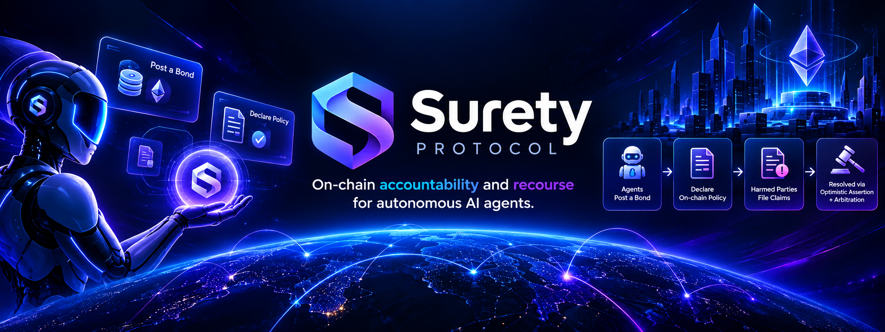
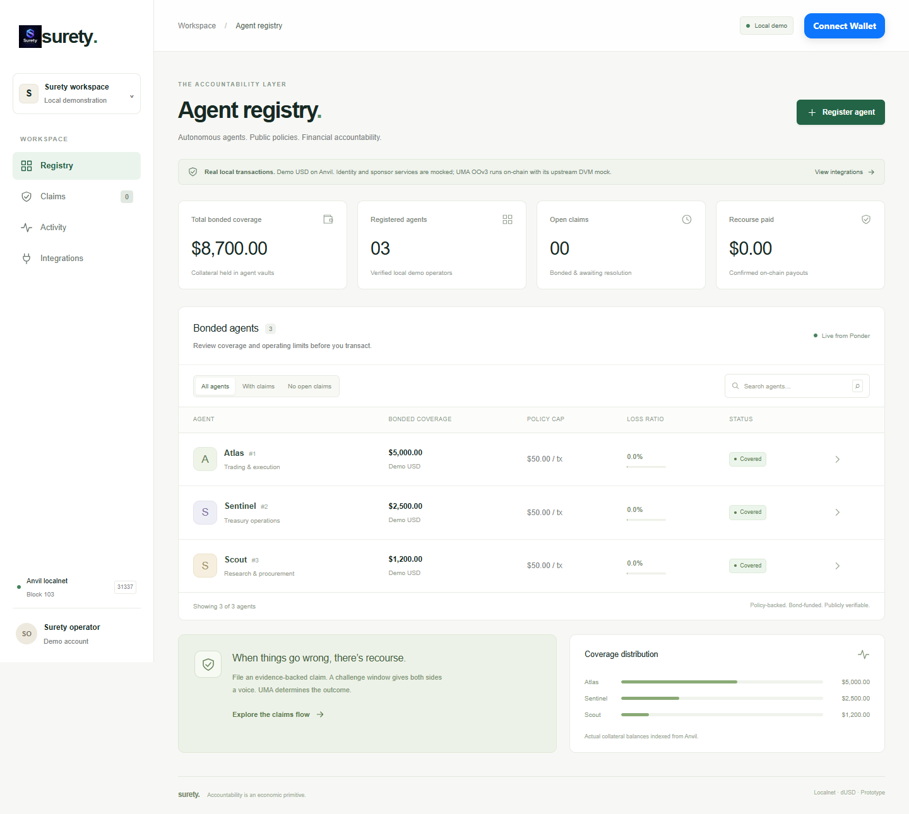
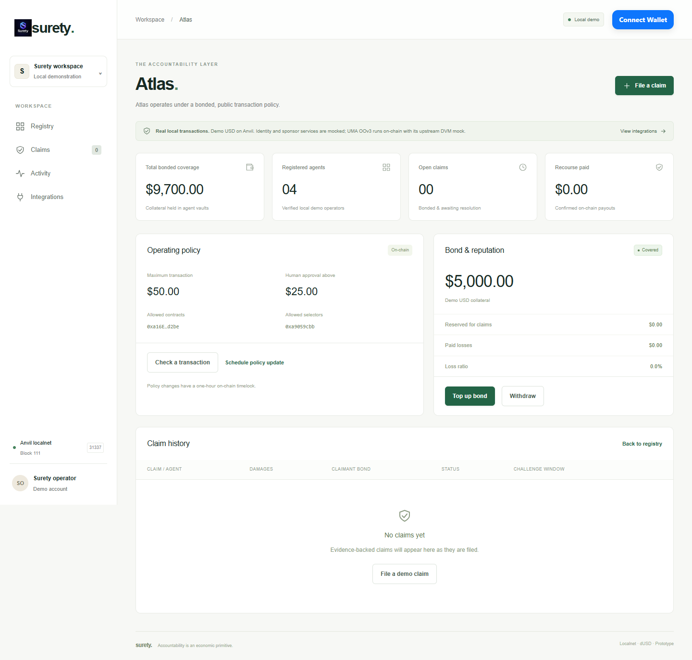
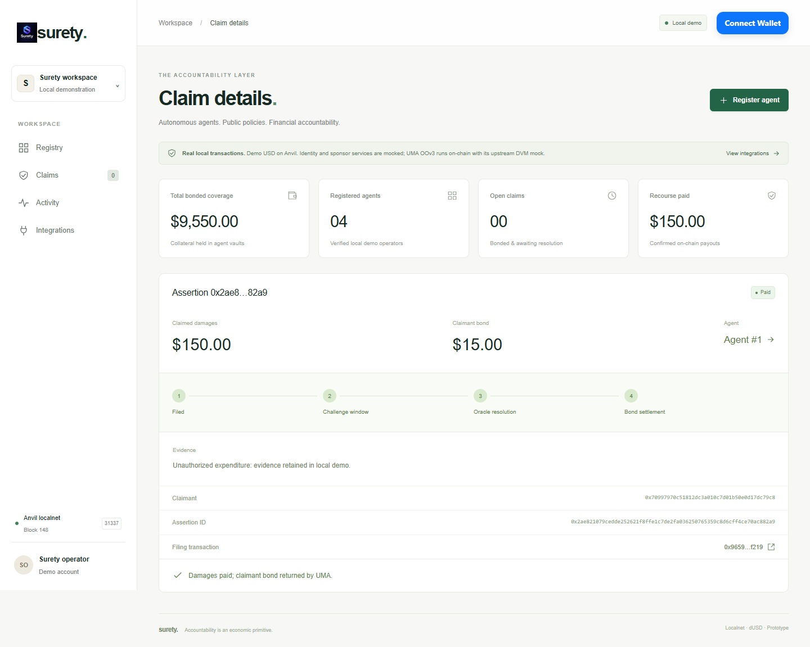
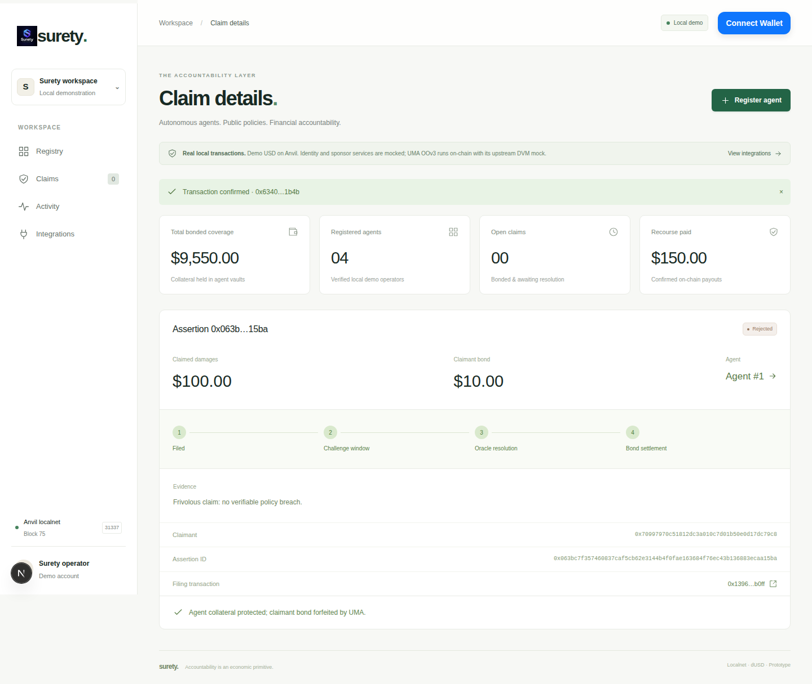
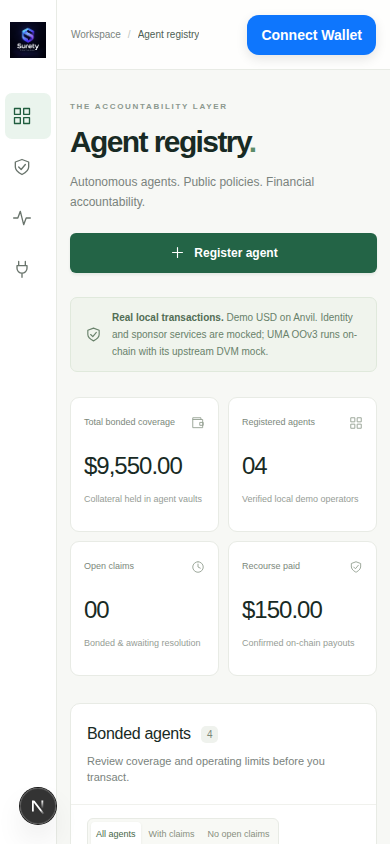

# Surety Protocol

Public policies. Bonded agents. Financial recourse.

Surety is an on-chain accountability prototype for autonomous agents. Operators publish policies and fund collateral vaults. Counterparties file evidence-backed, bonded claims. UMA Optimistic Oracle V3 handles assertions and disputes; successful claims receive payouts, while rejected claims preserve agent collateral.

**Release status:** working local Anvil prototype, not a production or public-testnet deployment. Financial flows use actual local transactions and upstream UMA code. Identity, DVM verdicts, and unavailable sponsor services are explicitly simulated. No real funds or partner-prize eligibility is claimed.

[Setup](#getting-started) · [Demo](#demo) · [Integrations](#partner-integrations) · [Deployments](docs/DEPLOYMENTS.md) · [Tests](#testing)

**Public frontend hosting:** follow the exact [Vercel deployment guide](docs/VERCEL.md). The public deployment is a labeled, read-only recorded preview; actual transactions run in the local demo.

For genuine public operation, follow the [public launch gate](docs/PUBLIC_LAUNCH.md). It covers persistent Postgres/Ponder hosting, contract-wiring validation, identity onboarding, automation, and the network decision required for UMA dispute support. `pnpm verify:public` provides read-only infrastructure checks; it is not a substitute for real multi-wallet lifecycle tests.

## Secure bring-your-own-key setup

Open `/setup` in the application for configuration status and testing instructions. Visitors use their own wallets—never paste private keys or seed phrases into Surety. Owners deploy their own workspace and supply their own RPC/database/service credentials through server-side environment variables. The setup page does not collect or store secrets, and adding keys does not activate unfinished partner integrations. Read the [security guide](docs/SECURITY.md) before configuring public services.

Unconfigured public hosts automatically load the bundled recorded data, with browser-wallet connection available. Real public transactions are supported only when actual Sepolia contracts, a hosted RPC/indexer and identity verification are configured. Visitors sign through their own wallets; server-side local accounts and mock oracle verdicts are never used online.

## Features

- Bonded registration with metadata, spend limits, counterparty and selector allowlists.
- Isolated OpenZeppelin-based vaults: top-ups, access control, claim reservations, and withdrawal locks.
- One-hour policy-change timelock.
- Evidence-backed UMA assertions, claimant bonds, and a 45-second local challenge window.
- Automatic unchallenged settlement through a local upkeep runner.
- Both disputed outcomes: uphold and pay, or reject and protect collateral.
- Live Ponder-backed registry, agent details, loss ratios, claim timelines and transaction receipts.
- Responsive dashboard, search, wallet connection and transparent integration status.
- Local policy preview for spend caps, allowlists and human-approval thresholds. It does not execute swaps or enforce external agent transactions.

## Use cases

**Trading agents:** publish execution limits and offer collateral-backed recourse for substantiated losses.

**Treasury automation:** expose spending boundaries, coverage and paid losses to stakeholders.

**Agent marketplaces:** compare declared policies and financial commitments before choosing an operator.

**Procurement agents:** attach an economic commitment to autonomous workflows without treating every complaint as automatically valid.

## Getting started

Requirements: Node.js 22+, pnpm 10.32.1, Git, and free ports 3000, 8545 and 42069. Initial installation needs internet access. Browser verification uses installed Google Chrome.

```sh
git clone https://github.com/saeedirfann/surety-protocol.git
cd surety-protocol
pnpm install --frozen-lockfile
pnpm --filter @surety/contracts install:std
pnpm demo
```

Open **[localhost:3000](http://localhost:3000)**. No wallet, sponsor account, faucet or real money is needed for demo controls. The launcher starts Anvil, builds and deploys contracts, seeds three agents, starts Ponder and Next.js, and runs the keeper. Keep the terminal open. Stop the demonstration with Ctrl+C.

Foundry binaries come from pinned npm packages. The first build downloads Solidity compiler 0.8.16. If a firewall blocks that download, install the matching compiler with Foundry and retry.

Environment examples are included at the root and in every workspace. The launcher enables local mock mode itself. Never commit API keys or private environment files.

Separate component commands: `pnpm chain`, `pnpm dev:indexer`, and `pnpm dev`. Use `pnpm demo` first for the seeded deployment. Do not run a second Anvil process on the same port. Restarting the chain invalidates previous claim IDs and receipts.

For a lower-memory, optimized frontend: run `pnpm build`, then `pnpm demo --production`. Run heavyweight builds separately from the browser demo on memory-constrained machines.

## Demo

1. Explore Atlas, Sentinel and Scout, seeded with $5,000, $2,500 and $1,200 in demo USD.
2. Open Atlas: inspect its $50 transaction cap, $25 approval threshold and allowlist.
3. Use **Check a transaction**: $20 to the allowed token contract passes; $100 is blocked.
4. File a $150 evidence-backed claim. Damages become reserved and withdrawals are locked.
5. Leave it unchallenged. After 45 seconds, the keeper settles through UMA and pays damages.
6. File another claim, open it, choose **Dispute claim**, then **Reject frivolous claim**. UMA receives a local upstream DVM mock verdict, forfeits the claimant bond and preserves agent collateral.
7. Use **Uphold claim** on a separate disputed assertion to demonstrate the opposite outcome.

Demo controls sign actual transactions through unlocked Anvil accounts. They are restricted to localhost, chain 31337 and `MOCK_MODE=true`.

## Project images

Artwork and real browser screenshots live in [RepoAssets](RepoAssets).









<details>
<summary>Mobile screenshot</summary>



</details>

## How it is built

| Layer | Technology | Responsibility |
| --- | --- | --- |
| Protocol | Solidity, Foundry, OpenZeppelin | Registry, policies, collateral and payouts |
| Oracle | UMA OOv3 | Assertion bonds, challenges and settlement |
| Identity | WorldIDGate | Router-verification interface and chain-restricted local mock |
| Indexer | Ponder + PGlite | Claim events and block-pinned agent/policy/balance snapshots |
| Frontend | Next.js, React, Tailwind, wagmi, viem, RainbowKit | Live dashboard and localhost demo controls |
| Keeper | viem | Polls upkeep and settles expired assertions |

`contracts/` contains the protocol and tests; `indexer/` contains the schema and handlers; `web/` contains the dashboard and API; `agent-sim/` contains the simulator workspace; `scripts/` contains launch, ABI export and browser verification; `shared/` and `deployments/` contain generated public configuration; `RepoAssets/` contains project imagery.

Dashboard reads are indexed, not per-row browser RPC requests. Balance/policy snapshots refresh every two blocks. This design and the linear keeper scan target a small demonstration dataset, not unbounded production scale.

## Partner integrations

| Infrastructure | Code location | Actual status |
| --- | --- | --- |
| UMA OOv3 | ClaimsManager and DemoEnvironment | Real upstream oracle locally; upstream DVM mock supplies verdicts |
| OpenZeppelin | Protocol contracts | Real SafeERC20, AccessControl, ReentrancyGuard, Pausable and Math |
| World ID | WorldIDGate.sol | Configured-router verifyProof path; demo identity is mocked. No IDKit app or genuine sandbox proof |
| ENS | Integration status | Not connected; metadata names are not ENS names |
| Curvegrid MultiBaas | Local policy-preview fallback | No deployment or API key; not MultiBaas execution |
| Intercepta | Labeled simulated risk result | No real API call without credentials |
| 1inch | Integration status | No quote, swap or off-venue detection implemented |
| EAS | Dependency smoke test | Installed interface only; no attestations |
| Chainlink / Gelato | ClaimsManager upkeep interface | Local keeper only; hosted job not registered |

Read [integration details](docs/PARTNER_INTEGRATIONS.md). Disputes use UMA rather than custom staking or jury voting. ERC-792 arbitration is not implemented.

## Deployments

Network: **Anvil local, chain 31337**. These are not Sepolia addresses or public explorer links.

| Contract | Local address |
| --- | --- |
| AgentRegistry | `0x275039fc0fd2eeFac30835af6aeFf24e8c52bA6B` |
| ClaimsManager | `0x07e7876A32feEc2cE734aae93d9aB7623EaEF4a3` |
| UMA OOv3 | `0x9CfA6D15c80Eb753C815079F2b32ddEFd562C3e4` |
| WorldIDGate | `0x427f7c59ED72bCf26DfFc634FEF3034e00922DD8` |
| Demo USD | `0xa16E02E87b7454126E5E10d957A927A7F5B5d2be` |

The launcher regenerates the authoritative [deployment manifest](deployments/local.json). Vault addresses are available in indexed agent records. See [deployment reference](docs/DEPLOYMENTS.md) for verification and reset behavior.

## Testing

```sh
pnpm test:contracts
pnpm typecheck
pnpm --filter @surety/web lint
pnpm build
pnpm test:e2e   # separate terminal while pnpm demo runs
pnpm test:hosted # VERCEL=1 frontend on port 3005, without Anvil or Ponder
```

Foundry covers happy/failure paths, permissions, identity, coverage reservations, timelocks, callbacks, payouts and disputed rejection, with 256-run fuzz tests for money flows. Browser verification covers registration, search, policy pass/block, over-coverage rejection, withdrawal locks, automatic payout, rejected claims, navigation and mobile overflow; it refreshes project screenshots.

GitHub Actions installs dependencies and forge-std, runs Foundry tests and TypeScript checks, lints the frontend and builds Next.js.

## Safety and remaining work

Unaudited prototype: do not send real assets or expose unlocked Anvil accounts. Demo server-side signing is not production wallet authorization. Keep the stack local.

Identity mocks do not prove personhood. Verdict buttons are not decentralized voting. The policy preview does not prevent external agent transactions. Production requires real identity and sponsor credentials, public-chain deployment and verification, audited enforcement, scalable indexing and keeper scheduling, and production authorization. No public hosting or Sepolia deployment has been performed.
